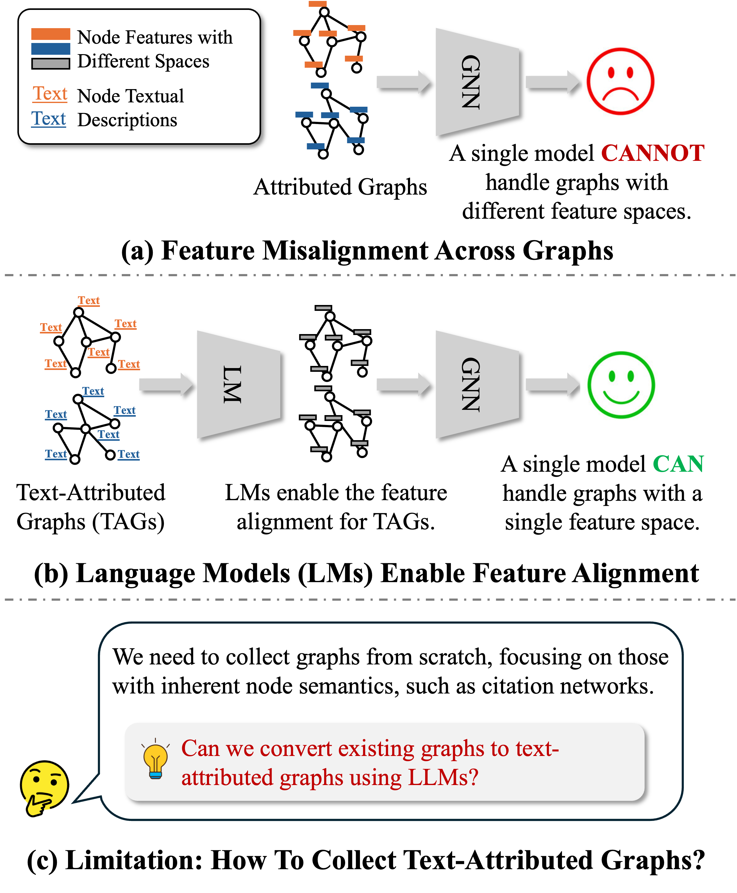
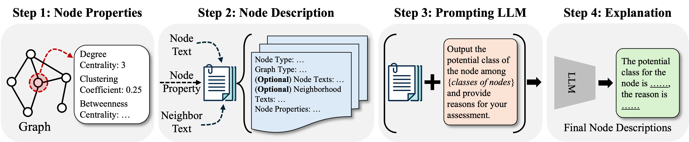

<div align="center">

# Can LLMs Convert Graphs to Text-Attributed Graphs? 

[](https://pytorch.org/get-started/locally/)
[](https://pytorch-geometric.readthedocs.io/en/latest/install/installation.html)

[](https://arxiv.org/abs/2412.10136)


The official implementation of TANS, a dataset synthesis method for graphs. 

Authored by [Zehong Wang](https://zehong-wang.github.io/), [Sidney Liu](https://www.linkedin.com/in/sidney-liu-4a6792156/), [Zheyuan Zhang](https://jasonzhangzy1757.github.io/), [Tianyi (Billy) Ma](https://tianyi-billy-ma.github.io/), [Chuxu Zhang](https://chuxuzhang.github.io/), and [Yanfang Ye](http://yes-lab.org/).
</div>

## Overview

### Motivation

<div align="center">

</div>

Graph neural networks (GNNs) have become a popular tool to learn node embeddings through message passing on these structures. However, a significant challenge arises when applying GNNs to multiple graphs with different feature spaces, as existing GNN architectures are not designed for cross-graph feature alignment. To address this, recent approaches introduce text-attributed graphs, where each node is associated with a textual description, enabling the use of a shared textual encoder to project nodes from different graphs into a unified feature space. While promising, this method relies heavily on the availability of text-attributed data, which can be difficult to obtain in practice. 

### Method



To bridge this gap, we propose a novel method named Topology-Aware Node description Synthesis (TANS), which leverages large language models (LLMs) to automatically convert existing graphs into text-attributed graphs. The key idea is to integrate topological information with each node's properties, enhancing the LLMs' ability to explain how graph topology influences node semantics. 

## Installation

You may use conda to install the environment. Please run the following script. 

```
conda env create -f environment.yml
conda activate TANS
```

## Quick Start

We use `cora`, `pubmed`, `usa`, `europe`, and `brazil` in our experiments. The last three will be downloaded when running the model. The previous two can be found in [here](https://drive.google.com/drive/folders/1j8bWBKpZk6-x5ccUH_bZRlabfjoEao1w?usp=sharing), and you should put them into `data/dataset`. 

For a quick start, you can download our processed encoded node embedding at [here](https://drive.google.com/drive/folders/1jQeeNerYB-fYW2KDTanhraNA_U5saUza?usp=sharing), and put them under the folder `data/text_emb`. 

You can test the quality of the embedding via training from scratch
```
cd TANS/train
python main.py --use_params --data cora --label_setting ratio/number --emb_method TANS --backbone gcn/gat/mlp --node_text title abstract --seed 1 2 3 4 5
```

Or domain adaptation
```
python da.py --use_params --pt_data usa --data europe --emb_method TANS --backbone gcn --seed 1 2 3 4 5
```

Or transfer learning
```
transfer.py --use_params --pt_data pubmed --data cora --emb_method TANS --backbone gcn 
```

## Processing the data by yourself!

### Generating node descriptions

The folder `TANS/preprocess` contains the code for preprocessing the data, i.e., using LLMs to generate the node descriptions. You can run the following code to generate the prompts: 

```
cd TANS/generate_text
sh preprocessing.sh
```

The `preprocessing.sh` contains (1) generating node topological properties and (2) generating prompts. Note that the first step is time-consuming. Thus, we provide the pre-computed properties in [link](https://drive.google.com/drive/folders/1iRyGcVZz9xTKErOleT13EtTv3QQC9QN-?usp=sharing), which can be put at path `data/property`. After generating the prompts, you can use the script `query_llms` to generate node descriptions via LLMs. We use OpenAI-4o-mini as default. 

```
python query_llms.py --model gpt-4o-mini --dataset cora --setting text_rich
```

For `cora` and `pubmed`, we support `text_rich` and `text_limit` setting. For `usa`, `brazil`, `europe`, we support `text_free` setting. 

We also provide our generated questions and responses [here](https://drive.google.com/drive/folders/1i_Fi5-cxf7HS2Tw6GOLmjeCL86fKoZiU?usp=sharing), which should be put inside `data/response`. 

### Encoding node description

Once you have generated the descriptions, you can use language models for encoding. 

Basically, you can run the script under the folder `TANS/preprocess`
```
sh encode_text.sh
```
where we use MiniLM as the default encoder.

Also, it is feasible to specify the parameters, like
```
python encode_text.py --data_name cora --enc_model gpt-4o-mini --llm_model minilm --node_text title abstract
```

Note that, in `node_text` term, you can set `title abstract` to indicate text-rich setting; `title` or `abstract` to indicate text-limit setting; and `none` to indicate text-free setting. 

## Contact Us

Please contact `zwang43@nd.edu` or open an issue if you have questions.

## Citation

If you find the repo is useful for your research, please cite the original paper properly.

```bibtex
@inproceedings{wang2025tans,
  title={Can LLMs Convert Graphs to Text-Attributed Graphs?},
  author={Wang, Zehong and Liu, Sidney and Zhang, Zheyuan and Ma, Tianyi and Zhang, Chuxu and Ye, Yanfang},
  booktitle={2025 Annual Conference of the Nations of the Americas Chapter of the Association for Computational Linguistics},
  year={2025}
}

@article{wang2025tans,
  title={Can LLMs Convert Graphs to Text-Attributed Graphs?},
  author={Wang, Zehong and Liu, Sidney and Zhang, Zheyuan and Ma, Tianyi and Zhang, Chuxu and Ye, Yanfang},
  journal={arXiv preprint arXiv:2412.10136},
  year={2024}
}
```